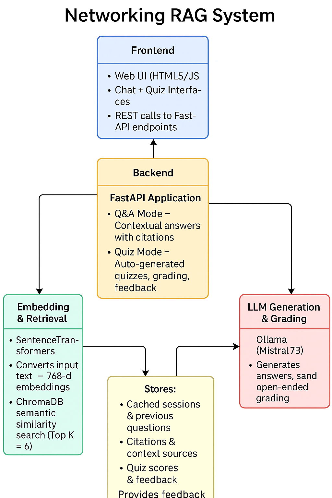
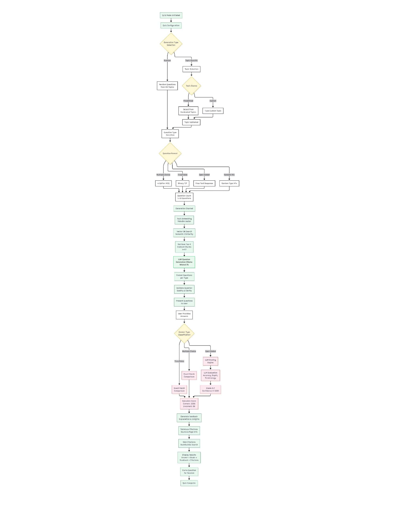

# Networking RAG System

An intelligent Retrieval-Augmented Generation (RAG) system for networking and security education. This system provides two modes: **Q&A Mode** for answering networking questions with context-based responses, and **Quiz Mode** for interactive learning with intelligent question generation and grading.

---
### Demo Link 
https://www.loom.com/share/b8e857590a01492db25c4721f110ddeb

## Quick Setup

### Prerequisites

- **Python**: 3.12.8
- **Ollama**: Latest version
- **RAM**: 6GB+ recommended
- **Storage**: ~1GB for models and database

### 1. Environment Setup

```bash
# Create virtual environment
python -m venv .rag

# Activate virtual environment
# On Windows:
.rag\Scripts\activate

# On Linux/Mac:
source .rag/bin/activate
```

### 2. Install Dependencies

```bash
pip install -r requirements.txt
```

### 3. Ollama Setup

Download and install Ollama from [ollama.com](https://ollama.com/download)

```bash
# Pull the mistral 7B model
ollama pull mistral:7b

# Start Ollama service (runs automatically on first use)
ollama serve
```

### 4. Run the Application

```bash
python main.py
```

Access the web interface at: **http://localhost:8000**

---

## Technical Stack

### Embedding Model

- **Model**: SentenceTransformers (msmarco-distilbert-base-v4)
- **Purpose**: Converts text queries and documents into vector embeddings for semantic search
- **Dimension**: 768-dimensional vectors

### Language Model

- **Model**: Ollama with mistral:7b
- **Purpose**: Generates contextual answers and quiz questions
- **Type**: Local LLM (runs on your machine)

### Vector Database

- **Database**: ChromaDB
- **Purpose**: Stores and retrieves document embeddings for fast semantic search

### API & Frontend

- **Backend**: FastAPI
- **Frontend**: Modern HTML/CSS/JavaScript interface
- **Communication**: REST API with JSON payloads

---

## System Flow

### Q&A Mode

The Q&A mode allows users to ask questions about networking topics and receive contextual answers with citations.

**Flow Overview:**

1. **Question Input**: User enters a question in the chat interface
2. **Generic Check**: The system uses the LLM to determine if the question is generic (e.g., "hi", "how are you") or domain-specific
3. **Generic Response**: If generic, the LLM provides a friendly response and prompts the user to ask networking questions
4. **Domain-Specific Processing**:
   - The question is converted into a vector embedding
   - The embedding is used to search the vector database for relevant document chunks
   - Top-K similar chunks are retrieved (default: 6 chunks)
5. **Answer Generation**: The LLM processes the question along with the retrieved context to generate a comprehensive answer
6. **Citation Mapping**: The system identifies which source documents were used and includes them as citations
7. **Response Display**: The answer is displayed with inline citations showing document sources and page numbers

### Quiz Mode

The Quiz mode provides interactive learning through intelligent question generation and grading.

**Flow Overview:**

1. **Quiz Configuration**:

   - **Generation Type**: Choose between Random Questions or Topic-Specific Questions
   - **Topic Selection**: For topic-specific mode, either select from predefined topics or type a custom topic
   - **Question Type**: Select question format (Multiple Choice, True/False, Open-Ended, or Random Mix)
   - **Question Count**: Specify number of questions (1-10)

2. **Question Generation**:

   - The selected topic is converted into a vector embedding
   - The embedding retrieves relevant context chunks from the vector database
   - The LLM generates questions based on the retrieved context
   - Questions are formatted according to the selected type

3. **Question Presentation**:

   - Multiple Choice: User selects from 4 options
   - True/False: User selects True or False
   - Open-Ended: User types a detailed answer

4. **Answer Evaluation**:

   - **Objective Questions** (Multiple Choice, True/False): Exact match comparison
   - **Open-Ended Questions**: LLM-based grading considering accuracy, depth, and terminology
   - Confidence scores are calculated for each answer

5. **Feedback & Citations**:
   - Correct answer is displayed
   - Detailed explanation is provided
   - Database citations show relevant source material
   - Web citations provide additional references
   - User grade (A-F) and confidence percentage are shown

**Key Features:**

- Flexible topic selection (predefined or custom)
- Multiple question types for varied learning
- Intelligent LLM-based grading for open-ended questions
- Comprehensive feedback with citations
- Confidence-based scoring system

---

## Security & Privacy Features

This system implements comprehensive security safeguards to protect against common web application threats and ensure privacy compliance.

### Security Features (5 Total)

#### 1. **Rate Limiting**
- **Protection**: Prevents DoS attacks and API abuse
- **Configuration**: 50 requests per 60-second sliding window
- **Behavior**: Automatically blocks excessive requests with HTTP 429 response
- **User Experience**: Displays rate limit status in response headers

#### 2. **PII Detection & Sanitization**
- **Detection**: Automatically identifies sensitive information:
  - Email addresses
  - Phone numbers
  - Social Security Numbers (SSN)
  - Credit card numbers
  - IP addresses
- **Action**: Auto-sanitizes detected PII before processing
- **Compliance**: Supports GDPR and privacy regulations
- **Logging**: Security events logged for audit purposes

#### 3. **SQL Injection Protection**
- **Detection Patterns**:
  - Boolean-based injection (`OR 1=1`)
  - Command injection (`DROP TABLE`, `DELETE`, etc.)
  - SQL comments (`--`, `/* */`)
  - UNION-based attacks
- **Action**: Blocks malicious requests immediately
- **Response**: Returns HTTP 400 with security error message

#### 4. **XSS (Cross-Site Scripting) Protection**
- **Detection Patterns**:
  - Script tags (`<script>`)
  - JavaScript protocols (`javascript:`)
  - Event handlers (`onclick`, `onerror`, etc.)
  - Embedded objects (`<iframe>`, `<object>`, `<embed>`)
- **Action**: Blocks XSS attempts with HTTP 400 response
- **Logging**: Critical security events logged

#### 5. **Input Validation**
- **Length Limits**: Maximum 5000 characters per text field
- **Sanitization**: Removes null bytes and excessive whitespace
- **Validation**: Ensures proper data types and formats
- **Error Handling**: Clear error messages for invalid inputs


## Network Tracing & Monitoring

Complete observability of data flow through the RAG pipeline with HTTP packet capture.

### Trace Capabilities


####  **HTTP Packet Capture**
Application-level packet capture similar to Wireshark:
- Full HTTP request details (method, URL, headers, body)
- Complete HTTP response details (status, headers, body)
- Packet sizes and timing information
- Saved to `logs/http_packets.log`


### Network-Level Packet Capture with Wireshark

For deeper network analysis, you can use Wireshark alongside the built-in HTTP packet capture to see actual TCP/IP packets at the network layer.

#### Quick Wireshark Setup

1. **Install Wireshark** (if not already installed) from [wireshark.org](https://www.wireshark.org/)
2. **Run Wireshark as Administrator**
3. **Select Capture Interface**: "Loopback: lo" (Windows) or "Loopback" (Linux/Mac)
4. **Apply Filter**: `tcp.port == 8000`
5. **Start Capture**
6. **Make requests** through the web interface
7. **Observe packets**: TCP handshake, HTTP requests/responses

#### Useful Wireshark Display Filters

```
http                           # Show only HTTP traffic
http.request.method == "POST"  # Show POST requests
http.response.code == 200      # Show successful responses
http.response.code == 400      # Show blocked requests (security)
tcp.stream eq 0                # Follow specific TCP stream
```

## Architecture Diagrams

### System Architecture 


<p align="center">
  
</p>


### Q&A Mode Agent Flow


**Process Details:**

- Generic detection prevents unnecessary database queries
- Semantic search finds contextually relevant documents
- LLM synthesizes information from multiple sources
- Citations provide source transparency

### Quiz Mode Agent Flow


<!--  -->
<p align="center">
  
</p>

---
